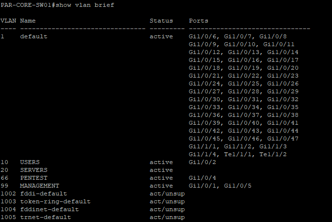
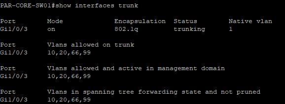

# Day 2: Layer 2 Foundations - VLANs and Trunking

### Laying the Tracks: Configuring VLANs and 802.1Q Trunks on Cisco IOS

**Summary:**
Today I moved from design to implementation on the physical networking layer. The focus was setting up the Layer 2 foundation using my Cisco switches. I wiped the configs and started fresh, creating the necessary VLAN database to segment traffic according to yesterday's design.

**Key Configurations:**
* Accessed Cisco switches via console.
* Created VLANs 10, 20, 66, and 99 and named them appropriately on the core Layer 3 switch.
* Configured access ports for end devices (Dell PCs).
* Crucially, I configured **802.1Q trunk ports** on the uplinks between switches and facing the IBM server to carry tagged traffic for multiple VLANs simultaneously.

**Challenge:** Ensuring the trunk encapsulation type was set correctly for older Cisco IOS versions before setting the mode to trunk.

#CiscoIOS #VLANs #Networking #CCNA
