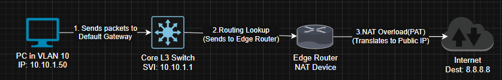

# Day 4: The Path to the Internet - Routing and NAT

### Escaping the Lab: Static Routing and NAT Configuration

**Summary:**
My internal networks could talk to each other, but they couldn't reach the internet. Today I configured the edge router and connected the core L3 switch to the outside world.

**The Missing Route Mystery:**
Initial ping tests from the L3 switch to `8.8.8.8` failed.
* *Troubleshooting:* A `show ip route` revealed the switch had no idea where to send traffic destined for unknown networks.
* *Solution:* Added a default static route (`ip route 0.0.0.0 0.0.0.0 [Next-Hop-IP]`) pointing to the edge router.

**The Return Path Problem:**
Traffic could now leave, but it couldn't get back. The edge router knew about the internet, but it didn't know where my internal subnets (e.g., `10.10.1.0/24`) lived.
* *Solution:* Added static routes on the edge router pointing back to the L3 switch for all internal networks.

**Final Step: NAT:** Configured Network Address Translation (NAT) overload (PAT) on the edge router to allow all my internal lab IP addresses to share the single home IP address for internet access.

#NAT #StaticRouting #NetworkEngineering #Troubleshooting
