# Day 8: The Watchtower - Designing Security Monitoring with SPAN

### Eyes on the Network: Designing Intrusion Detection with SPAN and ESXi

**Summary:**
To practice Blue Team defensive skills, I needed a way to monitor network traffic. I decided to deploy Security Onion as my IDS/SIEM platform.

**The Challenge:**
How to get raw network traffic from the physical Cisco switch into a virtual machine inside ESXi.

**The Solution:**
1.  **Physical:** Dedicated a specific port on the L3 switch as a **SPAN (Switched Port Analyzer) destination** and connected it to a second physical NIC on the IBM server.
2.  **Cisco Config:** Configured a monitor session on the switch to mirror traffic from VLANs 10, 20, and 66 to that destination port.
3.  **Virtual Config:** Created a new, dedicated vSwitch in ESXi connected to that second NIC. Crucially, I enabled **Promiscuous Mode** on this vSwitch so the virtual interface could accept traffic not addressed to its own MAC address.

This setup provides a "tap" for the Security Onion VM to sniff live wire traffic.

```mermaid

graph LR
    %% Define Nodes
    Sources(Source Traffic\nVLANs 10, 20, 66)
    
    Switch(Cisco Switch\nSPAN Session)
    PhysicalPort[Physical Switch Port\nSPAN Destination\ne.g., Gi0/24]
    
    ServerNIC[IBM Server Physical NIC\nESXi Uplink\ne.g., vmnic1]
    
    vSwitch(ESXi vSwitch_SPAN\nPromiscuous Mode: ACCEPT)
    
    SO_VM[Security Onion VM\nMonitoring Interface]

    %% Define Connections
    Sources -- 1. Traffic flows normally --> Switch
    Switch -- "2. SPAN mirrors traffic" --> PhysicalPort
    
    %% Use thick line for physical cable
    PhysicalPort == "3. Physical Ethernet Cable" ==> ServerNIC
    
    ServerNIC -- "4. Ingests raw frames" --> vSwitch
    vSwitch -- "5. Promiscuous mode passes\ntraffic to VM" --> SO_VM

    %% Simple Styling to highlight key areas
    style PhysicalPort fill:#fff9c4,stroke:#fbc02d,stroke-width:2px
    style vSwitch fill:#ffcdd2,stroke:#e53935,stroke-width:3px,color:black
    style SO_VM fill:#c8e6c9,stroke:#43a047,stroke-width:2px

```

#BlueTeam #SPANPort #NetworkMonitoring #ESXiNetworking
