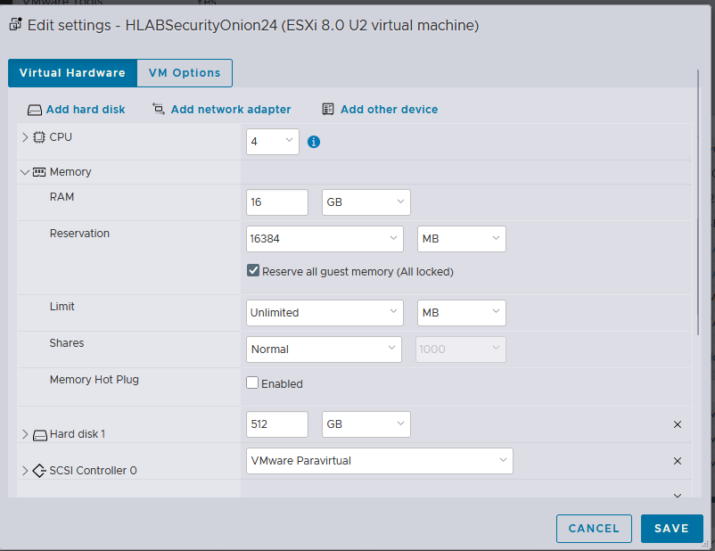

# Day 9: The Install Battle - Troubleshooting Security Onion

### The Struggle is Real: Deep Troubleshooting Security Onion Installation

**Summary:**
Attempting to install Security Onion 2 on ESXi proved to be the most significant challenge of the entire build. I encountered repeated failures where the OS would install, but the setup wouldn't complete, services like `firewalld` and Nginx wouldn't start, and it would boot into a `grub>` prompt.

**The Investigation & Fixes:**
It required multiple iterations of deep troubleshooting:
1.  **ISO Integrity:** Validated SHA256 checksums to rule out corrupted downloads.
2.  **Boot Issues:** Learned to meticulously disconnect the virtual ISO file immediately upon the first reboot to prevent boot loops.
3.  **The Root Cause (Memory):** The breakthrough came when realizing that ElasticSearch (a core component) requires massive memory upfront during initialization. Even with 16GB assigned, ESXi's dynamic allocation was too slow, causing the service to fail and break the entire setup script.
* *Solution:* I set a strict **16GB Memory Reservation** in ESXi, guaranteeing physical RAM to the VM. The next installation succeeded perfectly.

#Troubleshooting #LinuxAdmin #SecurityOnion #ElasticSearch
