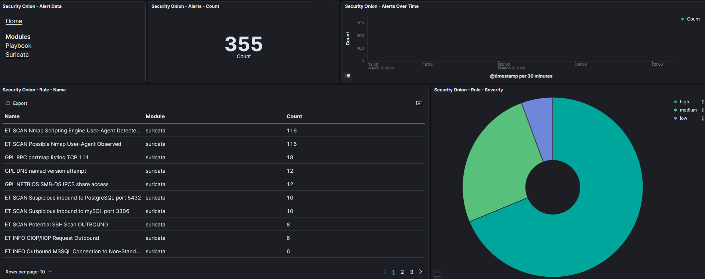

# Day 10: Final Polish - Time, DNS, and First Alerts

### Lab Operational: Time Synchronization and First IDS Alerts

**Summary:**
With Security Onion installed, the final hurdle was getting the Web UI accessible and alerts firing.

**The Time/DNS Issue:**
The Security Onion Web UI was timing out. Troubleshooting revealed that while ping worked, DNS was not configured on the VM, preventing it from resolving external dependencies. Furthermore, the system timezone kept reverting to UTC because I hadn't set it during the initial OS install phase, causing SaltStack to overwrite my manual changes.
* *Fix:* A final, clean reinstall setting the timezone correctly in the CentOS installer and ensuring correct DNS settings during the `so-setup` wizard resolved these issues.

**First Alerts:**
With the system stable and time synchronized, I ran an Nmap scan from my Kali machine in VLAN 66 against a target in VLAN 10. I verified on the Cisco switch that the SPAN session was active, and moments later, Suricata alerts populated the Security Onion dashboard.

The lab is officially live.

#CybersecurityLab #InfoSec #SecurityOnion #Success
