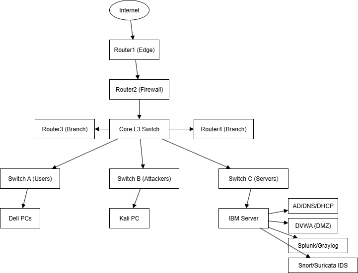

# Cybersecurity Home Lab Project

## Project Overview
This repository documents the design, construction, and operation of my dedicated cybersecurity home lab. The goal of this project was to create a realistic, segmented enterprise network environment to practice skills related to Network+, CCNA, Security+, and Pentest+ certifications.

The lab allows for safe execution of both Red Team (offensive) attacks and Blue Team (defensive) monitoring and response.

## Hardware & Software Stack

A combination of enterprise-grade physical hardware and industry-standard virtualization software.

### Hardware
* **Compute:** IBM M5 Server (Dual Xeon, 512GB RAM), 2x Dell Optiplex Micro PCs.
* **Networking:** Cisco 3750-X Layer 3 Core Switch, Cisco 2960 Layer 2 Access Switches, Cisco 1900/2900 Series Routers.

### Key Software
* **Hypervisor:** VMware vSphere Hypervisor (ESXi 8)
* **Blue Team (Defensive):** Security Onion 2 Solutions (Suricata IDS, Zeek, Kibana/Elasticstack)
* **Red Team (Offensive):** Kali Linux Rolling, Metasploit Framework
* **Infrastructure:** Windows Server 2019 (Active Directory Domain Services), Ubuntu Server.

## Network Topology

* **VLAN 10 (Users):** General workstations.
* **VLAN 20 (Servers):** Production assets (AD, Web) to be defended.
* **VLAN 66 (Pentest):** Isolated zone for attacker machines and vulnerable targets.
* **VLAN 99 (Management):** Out-of-band network device and hypervisor management.

---

## The Build Journey (10-Day Log)
Below is the complete, step-by-step documentation of how this lab was built from scratch, including major troubleshooting hurdles faced along the way.

* **Day 1:** [Architecture Design and Hardware Selection](Build-Log/01-Hardware-and-Architecture.md)
* **Day 2:** [Layer 2 Foundation: VLANs and Trunking](Build-Log/02-Layer2-VLANs-and-Trunking.md)
* **Day 3:** [Layer 3 Core: Inter-VLAN Routing with SVIs](Build-Log/03-Layer3-InterVLAN-Routing.md)
* **Day 4:** [Internet Connectivity: Routing and NAT](Build-Log/04-Internet-Routing-and-NAT.md)

---

## Future Experiments

---

## Table of Contents

1.  [Lab Architecture](./01_Lab_Architecture.md)
2.  [Virtual Machine Setup](./02_Virtual_Machine_Setup.md)
3.  [Networking Configuration](./03_Networking_Configuration.md)
4.  [Experiments and Write-ups](./Experiments/)
5.  [Build Log](./Build-Log/)
